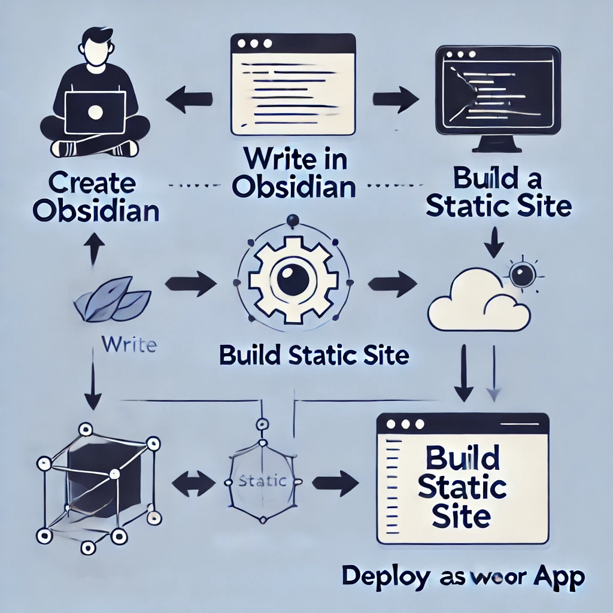

## 소개

Obsidian을 이용한 문서 작성, 정적 사이트 빌드 및 웹 배포에 대한 종합 가이드에 오신 것을 환영합니다. 이 카테고리는 웹 매뉴얼, 블로그, 오프라인 매뉴얼 앱을 만들기 위한 전체 과정을 안내합니다.

## 개요
## 개요
## 개요

이 카테고리는 Obsidian이라는 강력한 노트 앱을 활용하여 문서를 작성, 관리 및 출판하는 방법을 돕기 위해 만들어졌습니다. Obsidian에서 콘텐츠를 작성하고, 정적 사이트를 빌드하며, 다양한 용도로 배포하는 방법을 다룹니다. 문서 작성부터 출판까지의 원활한 워크플로우를 제공하는 것이 목표입니다.

## 학습 내용

- **[Obsidian](옵시디언이란.md)에서 문서 작성 및 관리:** Obsidian의 기본 사용법부터 시작하여, 노트와 문서를 효과적으로 작성하고 조직하는 방법을 소개합니다. Obsidian의 강력한 기능인 백링크, 그래프 뷰 및 플러그인에 대해 배웁니다.
    
- **[정적 사이트](staticsite/about/staticsite란) 빌드:** Obsidian에서 준비된 콘텐츠를 정적 사이트로 변환하는 방법을 설명합니다. 이를 위해 빠르고 유연한 정적 사이트 생성기인 Hugo와 같은 도구를 사용합니다. Hugo를 설정하고, 필요에 맞게 구성하며, Obsidian과 통합하는 방법을 배웁니다.
    
- **사이트 배포:** 정적 사이트를 빌드한 후, 배포 과정을 안내합니다. GitHub Pages, Netlify 등의 호스팅 서비스에 사이트를 호스팅하는 방법을 다룹니다. 사이트를 라이브로 만들고, 청중이 접근할 수 있도록 단계별 지침을 제공합니다.
    
- **오프라인 매뉴얼 생성:** 오프라인에서도 문서를 접근할 수 있도록 사이트를 앱으로 패키징하는 방법을 살펴봅니다. 이는 오프라인 매뉴얼이나 가이드 작성에 특히 유용합니다.

## 이 방법을 사용하는 이유

- **유연성과 제어:** Obsidian을 사용한 콘텐츠 작성은 문서에 대한 완전한 제어를 제공합니다. Markdown으로 작성하고, 노트를 링크하며, 다양한 콘텐츠 간의 연결을 시각화할 수 있습니다.
    
- **효율성:** Obsidian 노트에서 정적 사이트를 빌드하는 것은 매우 효율적인 콘텐츠 관리 및 출판 방법입니다. 정적 사이트는 빠르고, 안전하며, 배포가 쉽습니다.
    
- **다양성:** 웹 매뉴얼, 블로그, 오프라인 가이드 등 다양한 용도로 활용할 수 있는 유연한 솔루션을 제공합니다. 처음부터 다시 시작할 필요 없이 다양한 출판 형식에 워크플로우를 적응시킬 수 있습니다.

## 활용 예시

- **개인 블로그 운영**: 쉽게 콘텐츠를 작성하고 관리할 수 있어 블로그 운영이 더욱 간편해집니다.
- **기술 문서 작성**: 소프트웨어 개발자나 엔지니어들이 기술 문서를 작성하고 배포하는데 유용합니다.
- **제품 매뉴얼 제작**: 제품 매뉴얼을 작성하고 업데이트하여 사용자들에게 제공할 수 있습니다.
- **팀 협업 도구**: 팀원들과의 협업을 통해 프로젝트 문서를 공유하고 수정할 수 있습니다.
- **강의 자료 관리**: 강의 노트, 슬라이드, 참고 자료 등을 체계적으로 관리하고 공유할 수 있습니다.- 
- **학생과 연구자**: 학습 노트, 연구 자료, 논문 등을 정리하고 공유할 수 있습니다.- 